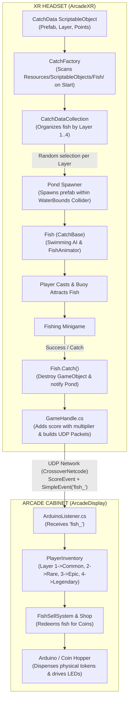

# Untitled Fishing Game

## 1. Project Overview

**Extended Reality Arcade** is a hybrid VR and arcade gaming experience centered around a dynamic fishing simulator. The project connects an immersive Meta Quest XR headset application with an arcade cabinet display and physical coin/lighting hardware over a local UDP network.

### Repository Structure

| Directory / Module | Description |
| :--- | :--- |
| `ArcadeXR/xrPRoject` | Meta Quest VR application (fishing mechanics, lake environment, fish AI, horror events). |
| `ArcadeDisplay/AFishingGameDisplay` | Arcade cabinet screen application (score, fish inventory, shop, coin redemption UI). |
| `CrossoverNetcode` | Shared UDP peer-to-peer networking package. |
| `Arduino` | Firmware for physical coin dispenser and cabinet LED lighting integration. |

## 2. Controls (Meta Quest VR)

| Input | Action |
| :--- | :--- |
| **Left Thumbstick** | Move player around the pond area. |
| **Right Thumbstick** | Rotate view. |
| **Right Grip** *(Hold / Release)* | Cast fishing line (hold to charge, release on swing). |
| **A Button** | • **Press:** Hook/Catch fish when biting at the buoy. • **Hold:** Reel in without a fish. • **During Minigame:** Tap or hold to balance the fish inside the catch zone. • **After Catch / Break:** Press to clip line back in. |
| **Right Trigger** | Select and interact with Network Setup UI. |
| **B Button** *(Debug)* | Trigger immediate environment upgrade / debug test. |

---

## 3. Network & Hardware Setup

### Arcade Network Config
- Network settings are persisted in `network_config.json`.
- `listenerPort`: Represents the incoming UDP port on the Arcade cabinet.
- `remotePort`: Represents the destination UDP port on the Quest XR headset.

### Headset Network Config
- When disconnected from the arcade cabinet, a floating virtual UI appears above the pond.
- Point and click using the **Right Trigger** to enter the Arcade IP and Port.
- Select **CONNECT** to initiate handshake.

---

## 4. Fish System Architecture & Implementation Guide

The fish system is data-driven via Unity **ScriptableObjects (SO)** and an automated factory pattern that scans the `Resources/` folder. Developers can add new fish varieties without modifying spawning scripts.

### A. The 5-Step Process to Implement a New Fish

#### Step 1: Create the 3D Model & Fish Prefab
1. Create or import a fish 3D mesh and texture.
2. Add a root `GameObject` with the following components:
   - `Fish` (inherits from `CatchBase`)
   - `FishAnimator` (handles swim, bite, and catch animation states)
   - `Collider` (for boundary checks and interaction)
3. Configure movement parameters on the `Fish` component:
   - `baseSwimSpeed`
   - `swimDepth`
   - `timeAtBuoy`
   - `catchScalarTo1`
4. Save as a prefab (e.g., in `Assets/Prefabs/Catchables/Fish/`).

#### Step 2: Create the CatchData ScriptableObject (SO)
1. In the Unity Project window, navigate to:  
   `Assets/Resources/ScriptableObjects/Fish/`  
   *(Organize under `Common`, `Rare`, `Epic`, or `Legendary` subfolders).*
2. Right-click in the Project window and select:  
   **Create** -> **Catch** -> **New Catch Data**
3. Name the asset (e.g., `GoldenTrout.asset`).

#### Step 3: Configure the CatchData Properties

| Property | Description |
| :--- | :--- |
| `Name` | Display name for the fish (e.g., `"Golden Trout"`). |
| `Description` | Flavor text and lore for the fish. |
| `ScoreValue` | Base points awarded upon capture. |
| `Prefab` | Assign the Fish prefab created in Step 1. |
| `SpawnLayer` | Rarity / Depth level layer: • **Layer 1** = Common • **Layer 2** = Rare • **Layer 3** = Epic • **Layer 4** = Legendary |

#### Step 4: Automatic Discovery (No Scene Wiring Needed!)
- `CatchFactory` scans `Resources/ScriptableObjects/Fish/` on `Start()` via `Resources.LoadAll<CatchData>()`.
- It sorts the loaded fish into internal layer pools (`CatchDataCollection`).
- Simply placing the new ScriptableObject into the `Resources` directory automatically registers it for spawning in the corresponding depth/layer!

#### Step 5: Catch & Arcade Integration
When a fish is caught, the game automatically:
1. Multiplies base `ScoreValue` by minigame accuracy.
2. Sends a `ScoreEvent` with total points to the Arcade Display.
3. Sends a `SimpleEvent` payload (`"fish_<Layer>"`) to the Arcade Display.
4. The Arcade's `ArduinoListener` maps Layer 1–4 directly to inventory rarity categories (*Common*, *Rare*, *Epic*, *Legendary*) for shop sales.

---

### B. Fish System Lifecycle Diagram

---
